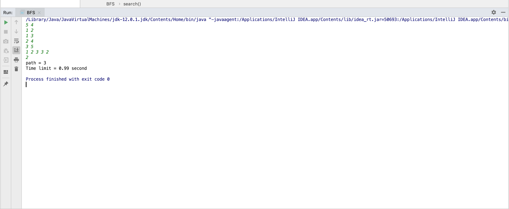
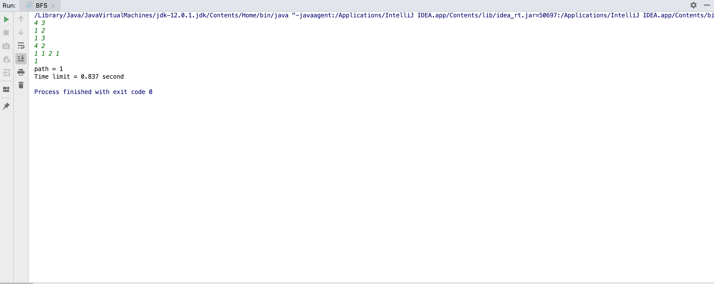

# BFS

BFS is the best choice for unweigted and undirected graph shortest path problem

I have implement two classes :

`Node` class which expresses each node in my graph.  
`BFS` class which is contain the main method and main logic of algorithm.

And these are some pictures for inputs and output of run my code:

1) First inputs :

4 3 
1 2 
1 3 
4 2 
1 2 1 1 
1 

2) Second inputs : 

5 4 
1 2 
1 3 
2 4 
3 5 
1 2 3 3 2 
2 

